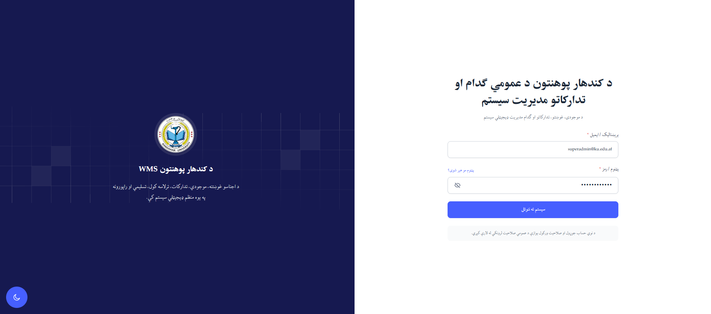
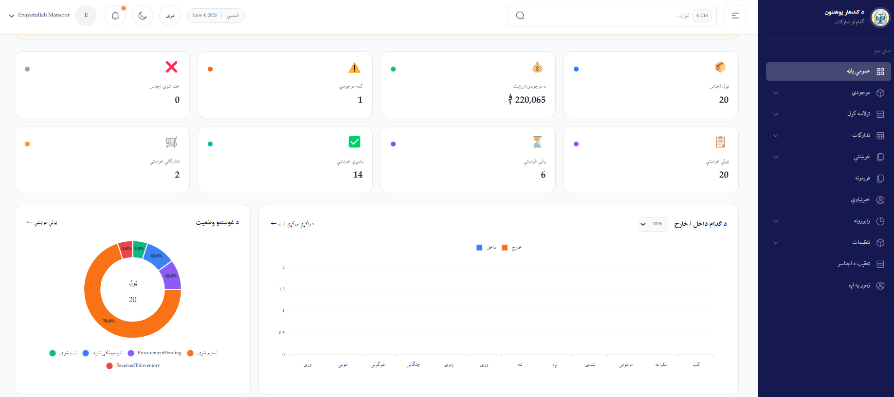
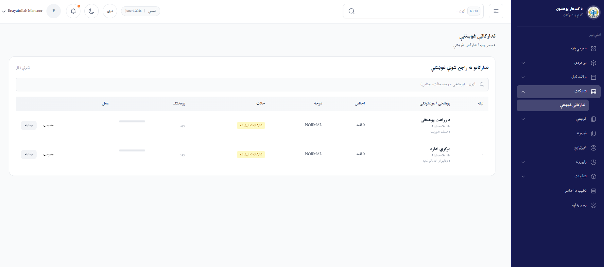
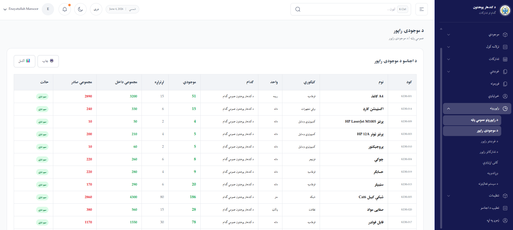
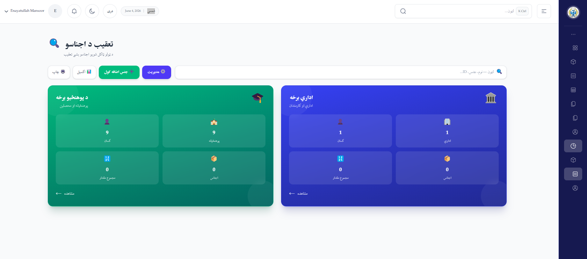
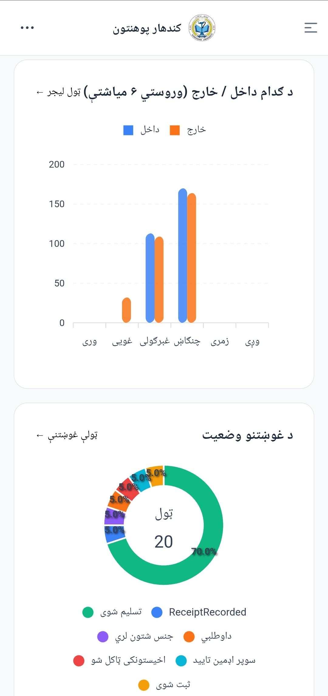
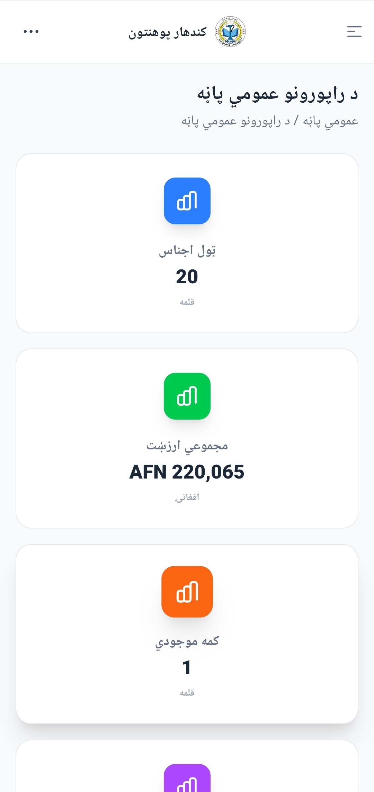

# EDH-TEAM Project Portfolio

EDH-TEAM is a professional software development team focused on building modern, scalable, and practical digital solutions for organizations, businesses, and institutions.

We design and develop web applications, business management systems, dashboards, automation tools, AI integrations, and digital solutions that solve real operational problems.

All projects listed in this portfolio are designed, developed, tested, and maintained by **EDH-TEAM**.

---

## Featured Projects

| # | Project | Type | Industry | Technologies | Repository | Demo |
|---|---------|------|----------|--------------|------------|------|
| 1 | Kandahar University WMS | Warehouse & Procurement Management System | Education / Public Administration | React, TypeScript, Node.js, Express.js, MySQL, Firebase | [GitHub](https://github.com/EDH-TEAM/kandahar_university_wms) | Coming Soon |

---

# Kandahar University Warehouse Management System

## Project Name
Kandahar University Warehouse Management System

## Project Type
Web-Based and Mobile-Responsive Warehouse, Inventory, Procurement, Reporting, and Asset Traceability Management System

## Client / Industry
Kandahar University / Education Sector / Public Administration

## Problem
Kandahar University needed a centralized digital system to manage warehouse inventory, procurement requests, stock-in and stock-out records, official forms, reports, item assignments, and department-based asset tracking.

The previous manual workflow made it difficult to track items accurately, monitor procurement progress, manage reports, and maintain clear records across faculties, departments, and administrative units.

## Solution
EDH-TEAM developed a complete web-based and mobile-responsive Warehouse Management System that helps Kandahar University manage inventory, procurement workflows, receiving, delivery, reporting, official forms, user roles, and asset traceability in one organized platform.

The system provides a clean interface for administrators and staff, supports Pashto/Dari right-to-left usage, and works properly on both desktop and mobile screens.

## Key Features
- Secure login system
- Dashboard with inventory and procurement statistics
- Inventory item management
- Stock-in and stock-out tracking
- Procurement request management
- Receiving and delivery reports
- Department and faculty-based item records
- Item traceability and assignment tracking
- User and role management
- Official forms and reports
- Print and Excel export options
- Search and filtering tools
- Mobile-responsive interface
- Pashto/Dari RTL interface support

## Technologies
- React
- TypeScript
- Tailwind CSS
- Node.js
- Express.js
- MySQL
- Firebase
- GitHub

## Screenshots

### Login Page

  

### Desktop View

  
  

  
  

### Mobile View

  
  

## Demo Link
Coming Soon

## Repository
[View Repository](https://github.com/EDH-TEAM/kandahar_university_wms)

## Role of EDH-TEAM
This project was fully designed, developed, tested, and maintained by **EDH-TEAM**.

EDH-TEAM was responsible for:

- Project planning
- System analysis
- UI/UX design
- Frontend development
- Backend development
- Database design
- Testing and debugging
- Documentation
- Deployment preparation

## Result
The system provides a complete digital platform for managing warehouse, procurement, inventory, reports, and asset traceability. It improves data organization, tracking, reporting, and administrative control for university warehouse operations.

The project works properly on both desktop and mobile devices, making it easier for staff and administrators to access and manage the system from different screen sizes.
